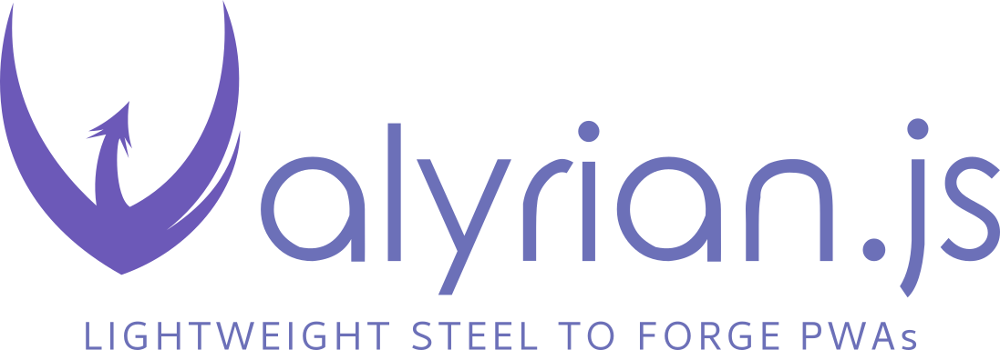

<div style="text-align: center" align="center">



<p>

[](https://npmjs.org/package/valyrian.js "View this project on npm")

[](https://tc39.es/ecma262/)

[](https://github.com/masquerade-circus/valyrian.js/blob/main/LICENSE)

[](dist/index.min.js)
[](dist/index.min.js)
[](dist/index.min.js)

[](https://github.com/Masquerade-Circus/valyrian.js/actions/workflows/test.yml)

[](https://github.com/Masquerade-Circus/valyrian.js/actions/workflows/codeql-analysis.yml)
[](https://www.codacy.com/gh/Masquerade-Circus/valyrian.js/dashboard?utm_source=github.com\&utm_medium=referral\&utm_content=Masquerade-Circus/valyrian.js\&utm_campaign=Badge_Grade)


[](https://github.com/Masquerade-Circus/valyrian.js/actions/workflows/test.yml)

</p>

</div>

# Valyrian.js

An isomorphic runtime framework for web apps.

Valyrian.js gives you one runtime model across browser and server so the way you render, update, route, fetch, and hydrate stays consistent as your app expands.

It is for teams that want explicit runtime behavior, deterministic updates, JSX/TSX authoring, and SSR without splitting their app into disconnected client and server mental models.

Here, "isomorphic" means the browser runtime and server runtime follow the same model: SSR, hydration, request isolation, and Node runtime APIs are extensions of the same web-first system, not separate product modes.

## Table of Contents

* [Quick Start](#quick-start)
  * [Browser (CDN)](#browser-cdn)
  * [Node (npm)](#node-npm)
* [Choose Your Path](#choose-your-path)
* [First 5 Minutes (Recommended)](#first-5-minutes-recommended)
* [Documentation](#documentation)
* [Why Valyrian.js](#why-valyrianjs)
* [Testing Philosophy](#testing-philosophy)
* [Tests](#tests)
* [More Guides](#more-guides)
* [Contributing](#contributing)
* [Legal](#legal)

## Quick Start

Get a working screen first. Start with the CDN path to prove the mount-and-render path in the browser before expanding into Node tooling or SSR.

### Browser (CDN)

```html
<script type="module">
  import "https://unpkg.com/valyrian.js";

  const { mount } = Valyrian;

  function App() {
    return "Hello from Valyrian.js";
  }

  mount("body", App);
</script>
```

Expected result: the text appears in the page body.

This snippet proves the runtime can mount component output into a root. `docs/2-getting-started.md` starts from this same example, then expands it into explicit VNodes and local TSX/JSX tooling.

### Node (npm)

```bash
npm install valyrian.js
```

Then follow [docs/2-getting-started.md](docs/2-getting-started.md) for the `inline` build flow and the automatic TSX runtime setup (`jsx: "react-jsx"` + `jsxImportSource: "valyrian.js"`).

### Runtime authoring surfaces

- `v(...)` and the automatic TSX runtime are both first-class vnode authoring surfaces.
- `Fragment` in the automatic runtime is the shared fragment sentinel, expanded later by the runtime instead of becoming a special vnode kind.
- `key` is structural vnode data (`vnode.key`), not component props.
- `flatTree()` remains the runtime step that expands fragments/components and flattens nested children.
- `trust()` keeps the same raw-HTML model in this phase.

## Choose Your Path

* **Try it now (no install):** use the CDN snippet above.
* **Understand the same example in more detail:** read [docs/1-introduction.md](docs/1-introduction.md), then continue with [docs/2-getting-started.md](docs/2-getting-started.md).
* **Add local TSX/JSX tooling in Node:** continue with [docs/2-getting-started.md](docs/2-getting-started.md) (Node path, automatic TSX runtime).
* **Expand the same model to SSR and request-scoped runtime behavior:** complete chapters 1-3, then go to [docs/7-full-stack-capability.md](docs/7-full-stack-capability.md).

## First 5 Minutes (Recommended)

1. Copy the CDN snippet into an `index.html` file.
2. Open it in your browser and confirm the UI renders.
3. Read [docs/1-introduction.md](docs/1-introduction.md) for the browser/server mental model behind that snippet.
4. Continue with [docs/2-getting-started.md](docs/2-getting-started.md) to expand the same example.
5. Continue with [docs/3-the-essentials.md](docs/3-the-essentials.md).

If this works, you already have the core Valyrian mental model.

## Documentation

* Start here: [docs/toc.md](docs/toc.md)
* Introduction: [docs/1-introduction.md](docs/1-introduction.md)
* Getting Started (No-Build First): [docs/2-getting-started.md](docs/2-getting-started.md)
* The Essentials: [docs/3-the-essentials.md](docs/3-the-essentials.md)
* Runtime core API reference: [docs/3.1-runtime-core.md](docs/3.1-runtime-core.md)
* Building Single Page Applications (SPA Hub): [docs/4-building-spa.md](docs/4-building-spa.md)
* Advanced State Management (Hub): [docs/5-advanced-state-management.md](docs/5-advanced-state-management.md)
* Browser/Server Runtime in Practice: [docs/7-full-stack-capability.md](docs/7-full-stack-capability.md)
* Utilities and Ecosystem (Hub): [docs/8-utilities-and-ecosystem.md](docs/8-utilities-and-ecosystem.md)
* Website: <https://valyrianjs.dev/>

## Why Valyrian.js

* One runtime model across browser and server.
* Explicit runtime behavior with deterministic updates.
* SSR, hydration, routing, request flow, and state fit the same runtime model.
* Built-in modules for routing, request, state, forms, offline, and server-side rendering.
* Web-first architecture that can start in the browser and expand into Node tooling without changing the core mental model.

Good fit:

* You want a smaller stack with fewer moving parts.
* You prefer explicit updates and clear runtime behavior.
* You want browser and server flows with a shared mental model.
* You want SSR and hydration without adopting a separate meta-framework as the core of your app architecture.

Not the best fit:

* You need a huge plugin ecosystem as your primary decision factor.
* You require a fully opinionated meta-framework workflow out of the box.
* You are looking for this repo to be a host-agnostic core for terminal, native, or non-web runtimes.

## Testing Philosophy

Valyrian.js tests are behavior-first and API-contract driven. Public modules validate happy paths, edge cases, and runtime consistency across browser-like and Node-like environments. Documentation examples are kept aligned with tested behavior.

## Tests (Framework Repository)

```bash
bun test
```

For development mode in this repository:

```bash
bun run dev:test
```

These commands are for contributors developing this framework repository.
For app usage, keep following [docs/2-getting-started.md](docs/2-getting-started.md).

## More Guides

* Recipes and integrations: [docs/9-recipes-and-integrations.md](docs/9-recipes-and-integrations.md)
* Meta-framework CLI (downstream workflow): [docs/10-meta-framework-cli.md](docs/10-meta-framework-cli.md)
* Contribution guide: [docs/11-contribution.md](docs/11-contribution.md)

## Contributing

* Run lint/format checks before opening a PR.
* Add or update tests for new behavior.
* Update docs in `docs/` whenever public behavior changes.

## Legal

Author: [Masquerade Circus](http://masquerade-circus.net). License [Apache-2.0](https://opensource.org/licenses/Apache-2.0)
