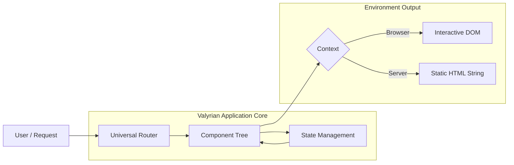

# 1\. Introduction

Valyrian.js is an isomorphic micro-framework designed to unify web application development. It provides a complete, cohesive ecosystem for building modern interfaces that run seamlessly in both the browser and the server, without the need for complex build steps or heavy external dependencies.

It is built on the premise that a framework should be a facilitator of the web platform, not an abstraction layer that hides it.

## 1.1. What is Valyrian.js?

Valyrian.js is a **Full-Stack Library** in a micro-package. It consolidates the essential pillars of modern application development—Rendering, Routing, State Management, and Server-Side capabilities—into a single, synchronized core.

  * **Agnostic Runtime:** It runs natively in any JavaScript environment (Browsers, Node.js, Deno, Bun) without requiring modification or transpilation.
  * **Batteries-Included:** It eliminates the need to assemble a fragmented stack of third-party libraries for basic needs like routing or HTTP requests.
  * **Unified Logic:** It allows developers to write application logic once and execute it anywhere, ensuring that the behavior on the server matches exactly the behavior on the client.

## 1.2. Philosophy

Valyrian.js was born to address the **"Incidental Complexity"** of the modern web.

Current development often involves managing a disjointed set of tools: one library for the UI, another for the router, another for the state, and a different framework entirely for the server. This fragmentation leads to fragile codebases, complex configurations, and a steep learning curve.

Valyrian.js proposes a **Unified Standard**:

1.  **Simplicity First:** The complexity of the application should come from the business logic, not the tools used to build it.
2.  **Platform Native:** Use the capabilities of the language and the browser directly. If the platform provides a solution (like Events or Storage), the framework should leverage it, not reinvent it.
3.  **Transparency:** The framework provides clear, deterministic flows of data and rendering. There is no "magic" happening behind the scenes; the developer retains full control over when and how updates occur.

## 1.3. The Architecture

Valyrian.js operates as a single cohesive unit where the boundaries between Client and Server are fluid.

Instead of treating the Frontend and Backend as separate entities that communicate via API calls, Valyrian architecture treats the application as a continuous flow of **State** and **Views** that can be resolved in any environment.

### Architectural Pillars

1.  **Universal Routing:** The application structure is defined by a single routing map that serves as the source of truth for both navigation in the browser and request handling on the server.
2.  **Isomorphic State:** Data management strategies are designed to persist and synchronize across environments, allowing sessions and application state to flow from the server to the client naturally.
3.  **Adaptive Rendering:** The engine automatically detects the execution context, delivering optimized HTML strings on the server for performance and SEO, and interactive DOM updates on the client for user experience.