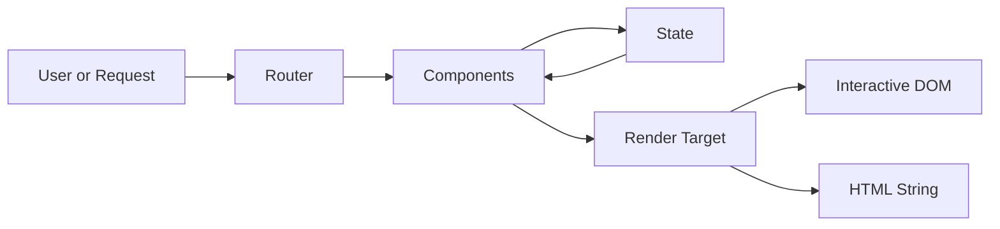

# 1. Introduction

Valyrian.js is an isomorphic micro-framework for building web apps with one runtime model across browser and server.

The goal is simple: ship fast, keep control, and add complexity only when your app needs it.

## What this guide gives you

* A fast first-success path (chapters 1-3).
* A practical SPA path (chapter 4 and its module pages).
* A clear expansion path for state, optimization, and full-stack runtime concerns.

## Estimated Time

* First render in browser: 2-5 minutes.
* Solid fundamentals (chapters 1-3): 20-40 minutes.

## 1.1. What Valyrian.js Is

Valyrian is designed around one mental model that works in both runtime contexts.

Core areas:

* UI rendering and vnode patching.
* Router and navigation lifecycle.
* State options (`POJO`, `pulse`, `pulse store`, `flux store`).
* Request and async orchestration modules.
* Node-side SSR and build utilities.

## 1.2. Philosophy

The project emphasizes:

1. **Simplicity first**: complexity should come from product logic, not framework ceremony.
2. **Platform-native APIs**: lean on Web/JS primitives whenever practical.
3. **Deterministic updates**: avoid hidden schedulers where explicit control is clearer.
4. **Unified behavior**: keep runtime semantics consistent between client and server.

## 1.3. Architecture Overview

## 1.4. Reading Path

Recommended order:

1. [./2-getting-started.md](./2-getting-started.md)
2. [./3-the-essentials.md](./3-the-essentials.md)
3. [./4-routing-and-navigation.md](./4-routing-and-navigation.md)
4. [./4-data-fetching-and-async.md](./4-data-fetching-and-async.md)
5. [./4-forms.md](./4-forms.md)

If your goal is first success only, complete chapters 2 and 3 first, then return for chapter 4 when you need routing and async workflows.
