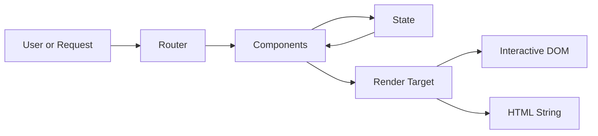

# 1. Introduction

Valyrian.js is an isomorphic runtime framework for web apps with one runtime model across browser and server.

It is for teams that want browser/server continuity, explicit runtime behavior, and deterministic updates without hiding app behavior behind framework ceremony.

The goal is simple: ship fast, keep control, and expand from browser rendering into SSR, hydration, and request-scoped server behavior without switching mental models.

## What this guide gives you

* A fast first-success path (chapters 1-3).
* A practical SPA path (chapter 4 and its module pages).
* A clear expansion path for state, optimization, and full-stack runtime concerns.

## Estimated Time

* First render in browser: 2-5 minutes.
* Solid fundamentals (chapters 1-3): 20-40 minutes.

## 1.1. What Valyrian.js Is

Valyrian is designed around one runtime model that works in both browser and server contexts.

Core areas:

* UI rendering and vnode patching.
* Router and navigation lifecycle.
* State options (`POJO`, `pulse`, `pulse store`, `flux store`).
* Request and async orchestration modules.
* Node-side SSR, hydration entry points, and build utilities.

## 1.2. Philosophy

The project emphasizes:

1. **Simplicity first**: complexity should come from product logic, not framework ceremony.
2. **Platform-native APIs**: lean on Web/JS primitives whenever practical.
3. **Deterministic updates**: avoid hidden schedulers where explicit control is clearer.
4. **Unified behavior**: keep runtime semantics consistent between browser and server.

## 1.3. Architecture Overview

```mermaid
flowchart LR
    input[User or Request] --> router[Router]
    router --> components[Components]
    state[State] --> components
    components --> state
    components --> target[Render Target]
    target --> dom[Interactive DOM]
    target --> html[HTML String]
```

`Render Target` is the key architectural bridge. In the browser, the runtime resolves to interactive DOM updates. On the server, the same component and routing model can resolve to HTML output, then hydrate back into interactive behavior on the client. That continuity is why SSR, hydration, and request-scoped execution belong to the same runtime story instead of separate feature buckets.

## 1.4. Reading Path

Recommended order:

1. [./2-getting-started.md](./2-getting-started.md)
2. [./3-the-essentials.md](./3-the-essentials.md)
3. [./4.1-routing-and-navigation.md](./4.1-routing-and-navigation.md)
4. [./4.2-data-fetching-and-async.md](./4.2-data-fetching-and-async.md)
5. [./4.3-forms.md](./4.3-forms.md)

If your goal is first success only, complete chapters 2 and 3 first, then return for chapter 4 when you need routing and async workflows.
