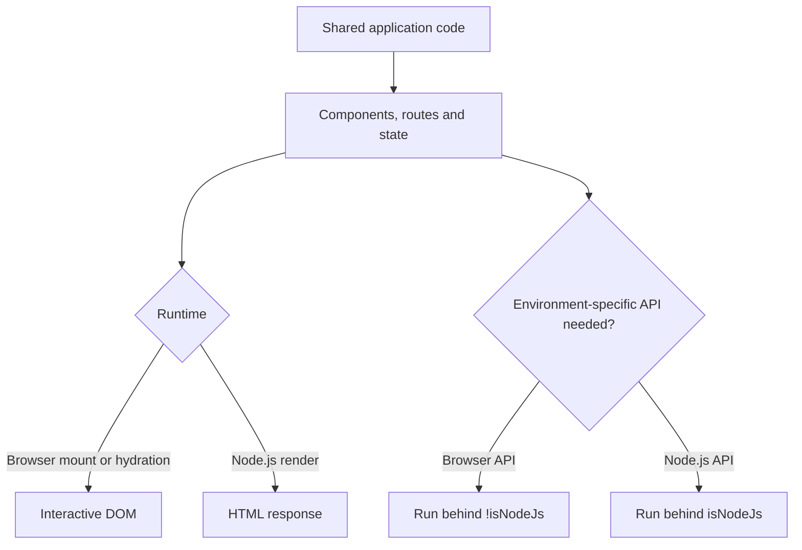

# 1. Introduction

Valyrian.js lets you build one application and run it in the browser and Node.js.

The browser mounts or hydrates DOM. Node.js imports the same application and renders HTML for the response. Components, routes and state owners stay in the application you already built.

Valyrian.js fits teams that want to inspect how an event, state change, request or route produces the next render in either runtime.

Start with one visible render, then add interaction, routing, data, forms, SSR and hydration while the application code stays recognizable.

If you started in `README.md`, keep the same picture in mind here: mount one component into a root, confirm it renders, then expand that same application into richer component trees, events, state, routing, data, forms and Node.js execution.

## What this guide gives you

* A fast first-success path (chapters 1-3).
* A cumulative Taskboard path that grows one application through seven stages.
* A practical SPA path (chapter 4 and its module pages).
* A clear expansion path for state, optimization, SSR and browser hydration.

## Estimated Time

* First render in browser: 2-5 minutes.
* Solid fundamentals (chapters 1-3): 20-40 minutes.

## 1.1. What Valyrian.js Is

Valyrian is designed so one application can run in browser and Node.js contexts.

That design supports complete app flows. Routing, state, requests, forms, SSR, hydration, offline work and PWA behavior can be composed as parts of the same application. Browser execution updates DOM. Node.js execution produces HTML or request-scoped output.

Core areas:

* UI rendering.
* Router and navigation lifecycle.
* State options (plain JavaScript objects, called `POJO` in the docs, plus `pulse`, `pulse store`, and `flux store`).
* Request and async orchestration modules.
* Forms, offline queues, network status and service worker behavior.
* Node.js SSR, hydration entry points, request isolation, build utilities and guarded environment-specific APIs.

## 1.2. Philosophy

The project emphasizes:

1. **Simplicity first**: complexity should come from product logic, not framework ceremony.
2. **Platform-native APIs**: lean on Web/JS primitives whenever practical.
3. **Deterministic updates**: avoid hidden schedulers where explicit control is clearer.
4. **Visible execution**: each interaction, request, route, form submit or hydration step should have a traceable entry point and observable result.
5. **Shared application code**: keep browser and Node.js execution inside the same application.

## 1.3. Architecture Overview

```mermaid
flowchart TD
    app[Shared application code] --> components[Components, routes and state]
    components --> runtime{Runtime}
    runtime -- Browser mount or hydration --> dom[Interactive DOM]
    runtime -- Node.js render --> html[HTML response]
    components --> branch{Environment-specific API needed?}
    branch -- Browser API --> browserGuard[Run behind !isNodeJs]
    branch -- Node.js API --> nodeGuard[Run behind isNodeJs]
```

The application imports stay shared. Browser execution mounts or hydrates interactive DOM, while Node.js execution renders HTML for the response. Use `isNodeJs` when shared components need an environment-specific branch, so browser-only or Node.js-only APIs stay inside the same application without running in the wrong environment.

## 1.4. Reading Path

Recommended order:

1. [./2-getting-started.md](./2-getting-started.md)
2. [./taskboard-tutorial.md](./taskboard-tutorial.md)
3. [./3-the-essentials.md](./3-the-essentials.md)
4. [./4.1-routing-and-navigation.md](./4.1-routing-and-navigation.md)
5. [./4.2-data-fetching-and-async.md](./4.2-data-fetching-and-async.md)
6. [./4.3-forms.md](./4.3-forms.md)

If your goal is first success only, complete chapter 2 first. If you want the official accumulating application path, continue into Taskboard before jumping to individual guides.

The intended onboarding flow is: `README.md` for the first render, this introduction for the browser/Node.js application path, `2-getting-started.md` for the local tooling path and `taskboard-tutorial.md` for the cumulative application.
