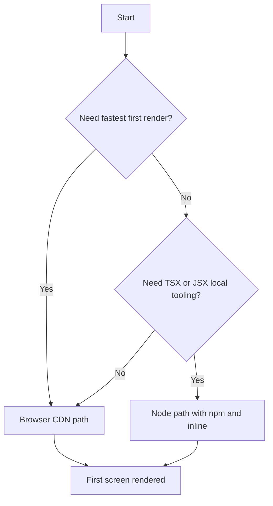

# 2. Getting Started (No-Build First)

Valyrian.js can run directly in the browser with ES modules, or from a Node.js project with the built-in `inline` utility.

Use this page to get a first working screen quickly, then continue with [./3-the-essentials.md](./3-the-essentials.md).

## Goal and Time

* **Goal:** render your first component.
* **Time:** 2-5 minutes (CDN path) or 10-15 minutes (Node path).

## Choose One Path

If this is your first time with the framework, start with the CDN path. It gives the fastest feedback loop and avoids setup friction.

## Path Selection Flow



## Prerequisites

* **Browser path (CDN):** Any modern browser with ES modules support.
* **Node path (local tooling):** Node.js `>=18` (as defined in `package.json`) and npm or bun.
* **Optional:** TypeScript + TSX if you want JSX/TSX authoring.

## 2.1. Browser Method (Recommended First)

This is the fastest way to confirm the runtime and your environment are working.

Create `index.html`:

```html
<!DOCTYPE html>
<html lang="en">
  <head>
    <meta charset="UTF-8" />
    <title>Valyrian.js App</title>
  </head>
  <body>
    <script type="module">
      import "https://unpkg.com/valyrian.js";

      const { v, mount } = Valyrian;

      function App() {
        return v("main", { style: "font-family: sans-serif; padding: 2rem;" }, [
          v("h1", null, "Hello from Valyrian.js"),
          v("p", null, "No build step required.")
        ]);
      }

      mount("body", App);
    </script>
  </body>
</html>
```

What happens here:

1. The browser loads Valyrian as a standard module.
2. `v()` creates VNodes in memory.
3. `mount()` renders the component tree into the selected root.

If you see the heading and paragraph rendered, your core setup is done.

## 2.2. Node.js Method (Built-in Tooling)

If you want TSX/JSX without a complex bundler setup, use `valyrian.js/node` and `inline`.

### 1. Install

```bash
mkdir my-valyrian-app
cd my-valyrian-app
npm init -y
npm install valyrian.js
```

### 2. Create your app entry

Create `index.tsx`:

```tsx
import { mount } from "valyrian.js";

const App = () => (
  <main style="font-family: sans-serif; padding: 2rem;">
    <h1>Hello World</h1>
    <p>Built with Valyrian internal tooling.</p>
    <button onclick={() => alert("It works")}>Click me</button>
  </main>
);

mount("body", App);
```

### 3. Create a build script

Create `build.js`:

```javascript
import fs from "fs";
import { inline } from "valyrian.js/node";

async function build() {
  const result = await inline("./index.tsx", {
    compact: true
  });

  fs.writeFileSync("./dist.js", result.raw);
}

build().catch((error) => {
  console.error(error);
  process.exit(1);
});
```

### 4. Build and serve

```bash
node build.js
```

Then load `dist.js` from a minimal HTML page:

```html
<!DOCTYPE html>
<html lang="en">
  <head>
    <meta charset="UTF-8" />
    <title>Valyrian App</title>
  </head>
  <body>
    <script src="./dist.js"></script>
  </body>
</html>
```

If you are testing locally, use any static server (for example `npx serve .`) and open that HTML page in the browser.

## Next Steps

1. Continue with [./3-the-essentials.md](./3-the-essentials.md) for components, directives, and update flow.
2. Move to [./4.1-routing-and-navigation.md](./4.1-routing-and-navigation.md) to build your first SPA route.
3. Use [./9-recipes-and-integrations.md](./9-recipes-and-integrations.md) when you are ready for Vite/Webpack and backend integration patterns.
