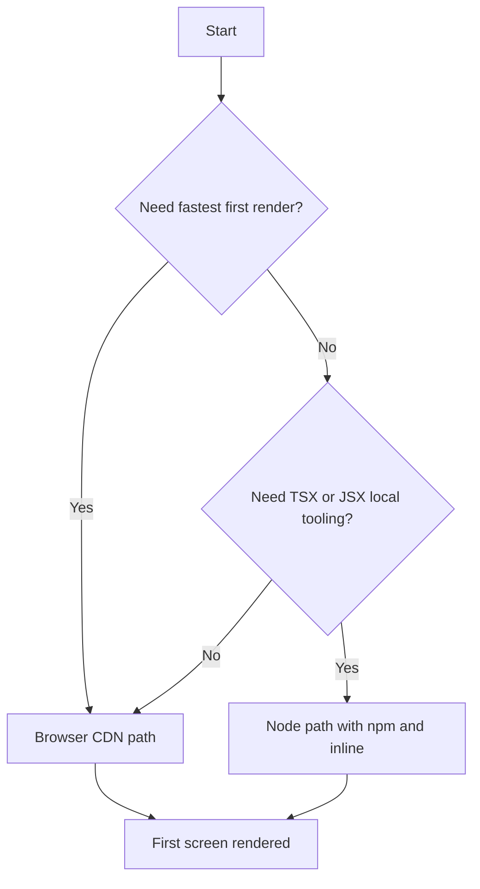

# 2. Getting Started (No-Build First)

Valyrian.js can run directly in the browser with ES modules, or from a Node.js project with the built-in `inline` utility.

Use this page to meet the runtime model in stages: first in the browser mount-and-render path, then in local Node tooling, and later in SSR as the same model expanded to the server.

## Goal and Time

* **Goal:** render your first component and understand the first proof points of the runtime model.
* **Time:** 2-5 minutes (CDN path) or 10-15 minutes (Node path).

If you came from `README.md`, this page starts with the same `mount("body", App)` idea and then expands it into a fuller component tree.

## Choose One Path

If this is your first time with the framework, start with the CDN path. It gives the fastest feedback loop, shows the mount/render path directly in the browser, and avoids setup friction.

## Path Selection Flow


```mermaid
flowchart TD
    start[Start] --> speed{Need fastest first render?}
    speed -- Yes --> cdn[Browser CDN path]
    speed -- No --> jsx{Need TSX or JSX local tooling?}
    jsx -- Yes --> node[Node path with npm and inline]
    jsx -- No --> cdn
    cdn --> success[First screen rendered]
    node --> success
```

## Prerequisites

* **Browser path (CDN):** Any modern browser with ES modules support.
* **Node path (local tooling):** Node.js `>=18` (as defined in `package.json`) and npm or bun.
* **Optional:** TypeScript + TSX if you want JSX/TSX authoring.

## 2.1. Browser Method (Recommended First)

This is the fastest way to confirm the runtime and your environment are working.

Treat this as the first proof of the model: render one component into one root and confirm the runtime output appears where you mounted it.

Create `index.html`:

```html
<!DOCTYPE html>
<html lang="en">
  <head>
    <meta charset="UTF-8" />
    <title>Valyrian.js App</title>
  </head>
  <body>
    <script type="module">
      import "https://unpkg.com/valyrian.js";

      const { mount } = Valyrian;

      function App() {
        return "Hello from Valyrian.js";
      }

      mount("body", App);
    </script>
  </body>
</html>
```

What happens here:

1. The browser loads Valyrian as a standard module.
2. `App()` returns the output for the root component.
3. `mount()` renders that output into the selected root.

If you see the text rendered, your core setup is done.

At this point you have verified the first browser-side render of the runtime model.

### Equivalent expanded form

The same example can be written in explicit VNode form when you want to see the structure Valyrian renders:

```html
<!DOCTYPE html>
<html lang="en">
  <head>
    <meta charset="UTF-8" />
    <title>Valyrian.js App</title>
  </head>
  <body>
    <script type="module">
      import "https://unpkg.com/valyrian.js";

      const { v, mount } = Valyrian;

      function App() {
        return v("main", { style: "font-family: sans-serif; padding: 2rem;" }, [
          v("h1", null, "Hello from Valyrian.js"),
          v("p", null, "No build step required.")
        ]);
      }

      mount("body", App);
    </script>
  </body>
</html>
```

Use the short string example as the default mental model. Use this expanded form when you want to see how components can return richer trees.

## 2.2. Node.js Method (Built-in Tooling)

If you want TSX/JSX without a complex bundler setup, use `valyrian.js/node` and `inline`.

This path proves a second point: the same runtime model can move into local Node tooling without changing how you think about components, mounting, or output.

### 1. Install

```bash
mkdir my-valyrian-app
cd my-valyrian-app
npm init -y
npm install valyrian.js
```

### 2. Add the TSX compiler settings

Create `tsconfig.json`:

```json
{
  "compilerOptions": {
    "jsx": "react-jsx",
    "jsxImportSource": "valyrian.js"
  }
}
```

This is the supported TSX path in Valyrian: TypeScript emits the automatic runtime and resolves TSX helpers from `valyrian.js`.

That automatic runtime is a first-class vnode surface, equivalent in contract to manual `v(...)` authoring. You do not need `v` in scope for TSX, and `key` stays as structural vnode data instead of becoming component props.

### 3. Create your app entry

Create `index.tsx`:

```tsx
import { mount } from "valyrian.js";

function App() {
  return (
    <main style="font-family: sans-serif; padding: 2rem;">
      <h1>Hello from Valyrian.js</h1>
      <p>The same mount mental model, now with TSX.</p>
    </main>
  );
}

mount("body", App);
```

### 4. Create a build script

Create `build.mjs`:

```javascript
import fs from "node:fs";
import { inline } from "valyrian.js/node";

async function build() {
  const result = await inline("./index.tsx", {
    compact: true
  });

  fs.writeFileSync("./dist.js", result.raw);
}

build().catch((error) => {
  console.error(error);
  process.exit(1);
});
```

### 5. Build and serve

```bash
node build.mjs
```

Then load `dist.js` from a minimal HTML page:

```html
<!DOCTYPE html>
<html lang="en">
  <head>
    <meta charset="UTF-8" />
    <title>Valyrian App</title>
  </head>
  <body>
    <script src="./dist.js"></script>
  </body>
</html>
```

Then serve that folder with a small static server and open the page in the browser. For example:

```bash
python3 -m http.server
```

Then open `http://localhost:8000`.

The important part is not the server choice. It is that Node becomes a practical runtime surface for authoring, transforming, and preparing the same browser-facing application model.

## Next Steps

1. Continue with [./3-the-essentials.md](./3-the-essentials.md) for components, directives, and update flow.
2. Move to [./4.1-routing-and-navigation.md](./4.1-routing-and-navigation.md) to build your first SPA route.
3. Continue to [./7.1-ssr.md](./7.1-ssr.md) when you are ready to see SSR as the next expansion of the same runtime model.
4. Use [./9-recipes-and-integrations.md](./9-recipes-and-integrations.md) when you are ready for Vite/Webpack and backend integration patterns.
