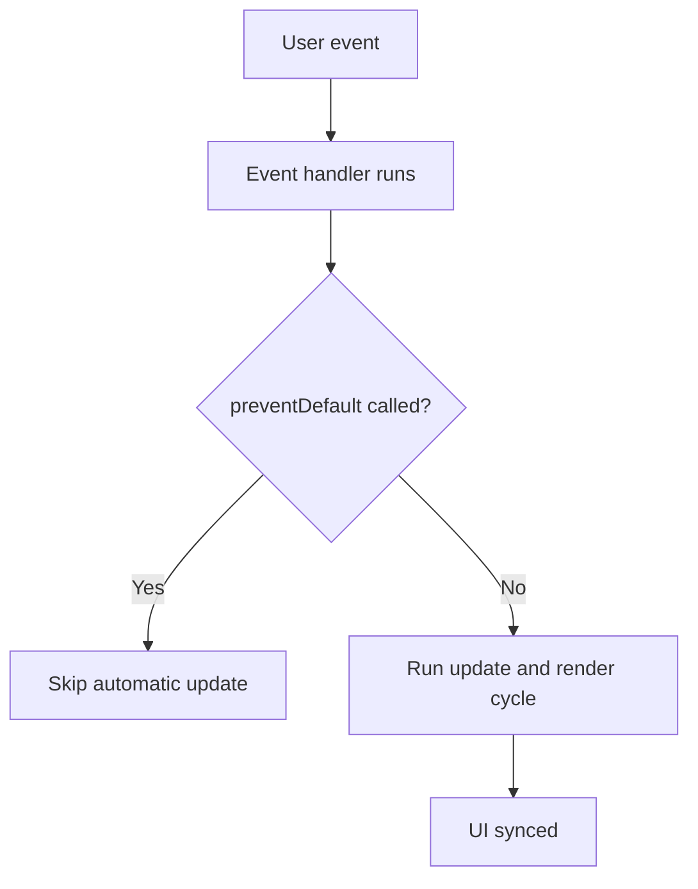
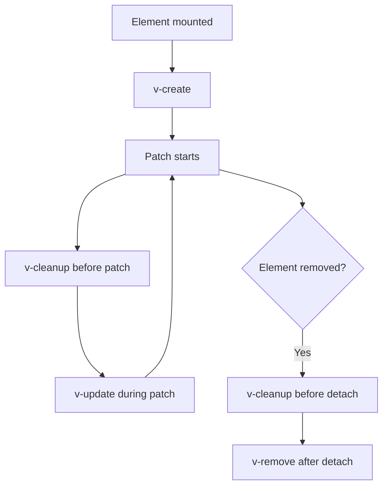

# 3. The Essentials (View and Interaction)

This chapter covers the core primitives you need to build interactive UI with Valyrian.js.

By the end of this page, you should be able to:

- Render components
- Handle events
- Use built-in directives
- Control async UI updates

If you need full API contracts for `mount/update/unmount`, lifecycle helpers, `debouncedUpdate`, `trust`, and `v-model`, see [./3.1-runtime-core.md](./3.1-runtime-core.md).

## 3.1. Hello World

Start here if you are new. This confirms your base render flow is working.

```tsx
import { mount } from "valyrian.js";

const App = () => (
  <main>
    <h1>Hello World</h1>
    <p>Welcome to Valyrian.js</p>
  </main>
);

mount("body", App);
```

## 3.2. Components

Valyrian supports:

- **Functional components** for straightforward rendering.
- **POJO components** (`{ view() {} }`) for grouped state + logic + view.

### Functional components

```tsx
const Button = ({ color, ...props }, children) => (
  <button style={`background: ${color};`} {...props}>
    {children}
  </button>
);
```

### POJO components

```tsx
const Counter = {
  count: 0,
  increment() {
    this.count += 1;
  },
  view() {
    return (
      <div>
        <span>Count: {this.count}</span>
        <button onclick={() => this.increment()}>+</button>
      </div>
    );
  }
};

mount("body", Counter);
```

### Intentional Versatility: Component Shape and State Model

Valyrian separates two independent decisions:

1. **Component shape** (function, POJO, class instance, props-only pure function).
2. **State model** (local/shared state, `createPulse`, `createPulseStore`, `FluxStore`).

These choices are combinable. Component shape does not force a single state model.

| Component shape | Where state lives | Strengths | Tradeoffs |
| --- | --- | --- | --- |
| Function | Closure, module variables, or stores | Simple and flexible syntax | Can mix concerns if boundaries are not explicit |
| POJO (`{ view() {} }`) | Object properties | State and methods grouped in one unit | If it uses `this`, mount the full object |
| Class instance (`new X()`) | Instance/static fields | Reuses OO patterns and supports multiple instances | Can add ceremony for simple cases |
| Props-only pure function | External state (container/store) | Deterministic render and easy testing | Needs a container to create state and handlers |

Compact counter examples with the three main reactive models:

```tsx
import { createPulse } from "valyrian.js/pulses";

const [count, setCount] = createPulse(0);

const CounterWithPulse = () => (
  <div>
    <span>{count()}</span>
    <button onclick={() => setCount((current) => current + 1)}>Increment</button>
  </div>
);
```

```tsx
import { createPulseStore } from "valyrian.js/pulses";

const counterStore = createPulseStore(
  { count: 0 },
  {
    increment(state) {
      state.count += 1;
    }
  }
);

const CounterWithPulseStore = () => (
  <div>
    <span>{counterStore.state.count}</span>
    <button onclick={() => counterStore.increment()}>Increment</button>
  </div>
);
```

```tsx
import { FluxStore } from "valyrian.js/flux-store";

const counterFlux = new FluxStore({
  state: { count: 0 },
  mutations: {
    INCREMENT(state) {
      state.count += 1;
    }
  }
});

const CounterWithFluxStore = () => (
  <div>
    <span>{counterFlux.state.count}</span>
    <button onclick={() => counterFlux.commit("INCREMENT")}>Increment</button>
  </div>
);
```

For exhaustive counter variants (shared/per-instance component shape patterns), see [./9.7-counter-variants-by-component-shape.md](./9.7-counter-variants-by-component-shape.md). For reactive equivalents, see [./9.8-reactive-counter-variants.md](./9.8-reactive-counter-variants.md).

## 3.3. Events and Update Cycle

Valyrian uses delegated native events (`onclick`, `oninput`, `onsubmit`, ...).

- After an event handler runs, Valyrian triggers a render update.
- If `event.preventDefault()` is called, the automatic update is skipped.

### Event Flow



```tsx
const Form = () => <input oninput={(event) => console.log((event.target as HTMLInputElement).value)} />;
```

If your UI does not update after interaction, check if `event.preventDefault()` is being called by mistake.

## 3.4. Basic Directives

### Structural: `v-if`, `v-show`

```tsx
const Panel = ({ visible }) => (
  <section>
    <p v-if={visible}>Mounted only when visible</p>
    <p v-show={visible}>Always mounted, hidden with CSS</p>
  </section>
);
```

Directive order note: when `v-if` resolves to `false`, later directives on that same vnode are skipped for that patch.

### Lists: `v-for`

`v-for` expects an iterable value plus a callback child.

```tsx
const TodoList = ({ items }) => (
  <ul v-for={items}>
    {(todo, index) => (
      <li key={todo.id}>
        {index + 1}. {todo.text}
      </li>
    )}
  </ul>
);
```

### Content: `v-html`, `v-text`

Use these when you want direct text/html assignment semantics.

```tsx
const state = {
  html: "<strong>Rich text</strong>",
  text: "Plain text only"
};

const Content = () => (
  <div>
    <div v-html={state.html} />
    <div v-text={state.text} />
  </div>
);
```

### Class toggles: `v-class`

`v-class` accepts:

- string: full class name string
- array: joined class names
- object: `{ className: boolean | () => boolean }`

## 3.5. Reactivity and Async Control

For synchronous user interactions, mutating plain objects in delegated event handlers is usually enough because updates are event-driven.

For async delegated handlers, Valyrian runs one automatic render after the handler returns.

Practical rule:

- Without `event.preventDefault()`, state changes before the first `await` are included in the automatic render.
- State changes after `await` need `update()`.
- If you call `event.preventDefault()` before the first `await`, automatic rendering is skipped and you must call `update()` for each transition.

Default async handler pattern (no `preventDefault`):

```tsx
import { update } from "valyrian.js";

const UserProfile = {
  loading: false,
  user: null,

  async load() {
    this.loading = true;

    const response = await fetch("/api/user");
    this.user = await response.json();

    this.loading = false;
    update();
  },

  view() {
    if (this.loading) return <p>Loading...</p>;
    if (!this.user) return <button onclick={() => this.load()}>Load user</button>;
    return <p>Hello {this.user.name}</p>;
  }
};
```

Manual-control async pattern (with `preventDefault`):

```tsx
import { update } from "valyrian.js";

const UserProfileManual = {
  loading: false,
  user: null,

  async load(event: Event) {
    event.preventDefault();

    this.loading = true;
    update();

    const response = await fetch("/api/user");
    this.user = await response.json();

    this.loading = false;
    update();
  },

  view() {
    if (this.loading) return <p>Loading...</p>;
    if (!this.user) return <button onclick={(event) => this.load(event)}>Load user</button>;
    return <p>Hello {this.user.name}</p>;
  }
};
```

## 3.6. Creating Custom Directives

Register directives with `directive(name, handler)`. The runtime exposes:

1. `value`: directive input value.
2. `vnode`: current vnode (with `vnode.dom`).
3. `oldProps`: previous props (`undefined` on mount).

If a custom directive needs to mutate vnode props, use `setAttribute(...)` for reliable integration with patch behavior.

### Directive Lifecycle Flow



```ts
import { directive } from "valyrian.js";

directive("focus", (enabled, vnode, oldProps) => {
  if (!oldProps && enabled && vnode.dom) {
    setTimeout(() => (vnode.dom as HTMLInputElement).focus(), 0);
  }
});
```

### Cleanup with `v-cleanup`

If your directive attaches listeners/resources, pair it with `v-cleanup`.

`v-cleanup` runs in two moments:

1. Before each patch cycle for existing nodes.
2. Before a node subtree is detached.

Use it as an idempotent teardown step.

```tsx
const App = () => (
  <div
    v-create={(vnode) => {
      const listener = () => console.log("resize");
      window.addEventListener("resize", listener);
      vnode.props.__listener = listener;
    }}
    v-cleanup={(vnode) => {
      window.removeEventListener("resize", vnode.props.__listener);
    }}
  />
);
```

Use this pattern to avoid duplicate subscriptions and memory leaks.

## Common Beginner Mistakes

1. Forgetting `name` in form controls used with directives like `v-model`/`v-field`.
2. Expecting post-`await` async state changes to render without calling `update()`.
3. Calling `event.preventDefault()` in delegated handlers and forgetting manual `update()` calls.
