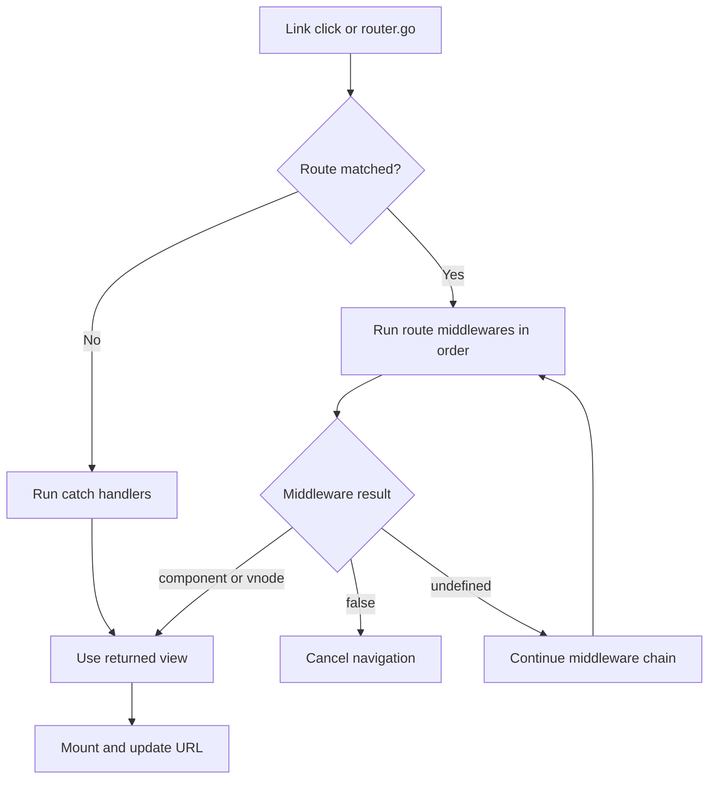

# 4.1. Routing and Navigation

Valyrian routing lives in `valyrian.js/router` and follows the same explicit runtime style as the rest of the framework.

## Quick Start Recipe

If you only do one thing on this page, do this first:

1. Create a router.
2. Add `/` and one extra route.
3. Mount with `mountRouter("body", router)`.
4. Add one `<a v-route="/your-route">` link and click it.

## Navigation Flow



## 4.1.1. Basic Router Setup

```tsx
import { Router, mountRouter } from "valyrian.js/router";

const router = new Router();

router.add("/", () => <h1>Home</h1>);
router.add("/about", () => <h1>About</h1>);

mountRouter("body", router);
```

You can also create routers with a path prefix:

```ts
const apiRouter = new Router("/app");
```

And inspect the route tree with:

```ts
const routeTable = router.routes();
```

## 4.1.2. Request Object Contract

Route handlers and middlewares receive `req` with:

* `req.path`: requested path string
* `req.url`: resolved route URL string (with prefix/query)
* `req.params`: dynamic route params
* `req.query`: parsed query values
* `req.matches`: route matches array (currently reserved, defaults to `[]`)
* `req.redirect(path)`: redirect helper

Query values are coerced to booleans/numbers when possible.

## 4.1.3. Dynamic Routes and Wildcards

Dynamic params:

```tsx
router.add("/users/:id", (req) => <UserPage id={req.params.id} />);
```

Wildcard routes:

```tsx
router.add("/files/.*", (req) => {
  const prefix = "/files/";
  const tail = req.path.startsWith(prefix) ? req.path.slice(prefix.length) : "";
  return <FileViewer path={tail} />;
});
```

Note: wildcard segments are matched by route pattern. If you need custom tail parsing, derive it from `req.path`.

Important: registration order still matters. For reader-safe behavior, register more specific routes before generic dynamic/wildcard routes.

Safe ordering pattern:

1. exact static routes (for example `/users/new`)
2. dynamic routes (for example `/users/:id`)
3. wildcard routes (`.*`)

## 4.1.4. Middlewares and Short-Circuiting

Middlewares run in registration order.

* Return a component/vnode to stop the chain and render immediately.
* Return `false` to stop navigation.
* Return `undefined` to continue.

```tsx
import { redirect } from "valyrian.js/router";

const requireAuth = (req) => {
  if (!isLoggedIn()) return req.redirect("/login");
};

router.add("/dashboard", requireAuth, () => <Dashboard />);

await redirect("/profile?tab=security");
```

Programmatic navigation can also use the exported `redirect` helper.

## 4.1.5. Subrouters

```tsx
const admin = new Router();
admin.add("/", () => <h1>Admin Home</h1>);
admin.add("/users", () => <h1>Admin Users</h1>);

const app = new Router();
app.add("/", () => <h1>Home</h1>);
app.add("/admin", admin);
```

## 4.1.6. Error Handling with `catch`

You can register handlers by status code, error class, string, or generic fallback.

```tsx
router.catch(404, () => <h1>Not found</h1>);
router.catch(TypeError, (_req, error) => <pre>{error.message}</pre>);
router.catch("NetworkError", () => <h1>Offline</h1>);
router.catch((_req, error) => <h1>Unhandled: {error.message}</h1>);
```

Order matters: specific handlers should be registered before broad handlers.

Router error handling also protects against circular `cause` chains in error objects.

## 4.1.7. Route Lifecycle Hooks

Route lifecycle callbacks are component-scoped.

Rules:

1. Register them inside a component context (render path or lifecycle hook).
2. `beforeRoute` runs when trying to leave the current route.
3. `afterRoute` runs only after the route successfully changes.
4. `afterRoute` does not run on initial entry.
5. A route transition is considered a change when `path`, `query`, or `params` differ.

```tsx
import { beforeRoute, afterRoute } from "valyrian.js/router";
import { onCreate } from "valyrian.js";

let isValid = true;

const Users = () => {
  onCreate(() => {
    isValid = true;

    beforeRoute(() => {
      if (!isValid) {
        return false;
      }
    });

    afterRoute(() => {
      isValid = false;
    });
  });

  return <div>Users</div>;
};
```

Registering the same function reference on rerenders does not stack duplicates.

Reader note: callbacks are scoped to the currently active route component tree. After a successful route change, old callbacks do not keep firing on future navigations.

## 4.1.8. `v-route` Directive

Use `v-route` on anchors for SPA navigation while keeping normal anchor semantics.

```tsx
const Nav = () => (
  <nav>
    <a v-route="/">Home</a>
    <a v-route="/about">About</a>
  </nav>
);
```

`v-route` sets `href` and an optimized click handler. Modifier keys (Ctrl/Cmd/Shift/Alt) keep native browser behavior.

## 4.1.9. Lazy Route Loading (Code Splitting)

Routes can resolve components asynchronously. This allows per-route code splitting with dynamic imports.

```tsx
import { Router, mountRouter } from "valyrian.js/router";

const router = new Router();

let usersPageModule: Promise<{ default: (props: { userId: string }) => unknown }> | null = null;
const loadUsersPage = () => {
  usersPageModule ||= import("./pages/users.page");
  return usersPageModule;
};

router.add("/users/:id", async (req) => {
  const module = await loadUsersPage();
  const UsersPage = module.default;
  return () => <UsersPage userId={req.params.id} />;
});

mountRouter("body", router);
```

Reader tip: keep one loader function per route/module so repeated navigations reuse the same module promise.

## Common Beginner Mistakes

1. Registering routes after calling `mountRouter`.
2. Forgetting to handle a fallback route (404).
3. Assuming wildcard tail data is parsed for you in custom formats instead of deriving it from `req.path`.
