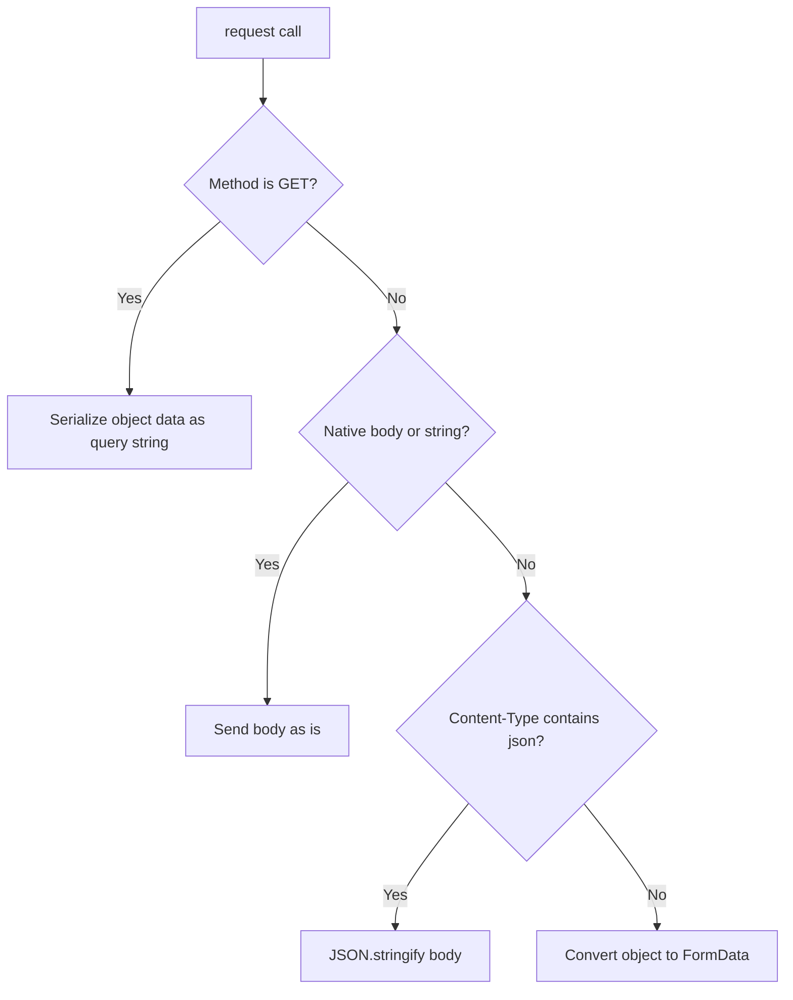

# 4.2.1. Requests (`valyrian.js/request`)

`request` is a small fetch wrapper with serialization rules, plugin hooks, and scoped clients.

## Quick Start

```ts
import { request } from "valyrian.js/request";

const users = await request.get("/api/users", { page: 1 });
```

## API Surface

Main call signature:

```ts
request(method, url, data?, options?)
```

Reader-safe default: use helper methods (`request.get`, `request.post`, ...). They pass the expected lowercase method names.

Generated helpers depend on `allowedMethods`:

* `request.get`
* `request.post`
* `request.put`
* `request.patch`
* `request.delete`
* `request.head`
* `request.options`

If you remove a method from `allowedMethods`, that helper is not generated.

```ts
const readonlyApi = request.new("/api", {
  allowedMethods: ["get"]
});

await readonlyApi.get("/users");
```

## Serialization Rules



Notes:

* `GET` + object data is appended as URL query params.
* Native bodies are passed through (`FormData`, `URLSearchParams`, `Blob`, `ArrayBuffer`, `DataView`, `ReadableStream`, string).
* Non-GET object bodies use JSON only when `Content-Type` includes `json`.
* Otherwise non-GET object bodies are converted to `FormData`.

## Response Parsing

`Accept` controls parsing:

Default: if you do not pass `Accept`, it uses `application/json`.

* `application/json` -> `response.json()` (invalid JSON resolves to `null`)
* `text/*` -> `response.text()`
* `*blob*` -> `response.blob()`
* `*arraybuffer*` -> `response.arrayBuffer()`
* Otherwise response object is returned as body value.

For non-OK responses, an error is thrown with `response` and optional parsed `body`.

Reader note: non-OK parsing follows the same `Accept` logic for `text/*` and `application/json`. Other accept types keep `body` unset on the thrown error.

## Scoped Clients and Options

```ts
const api = request.new("/api", {
  headers: { "Content-Type": "application/json" },
  urls: { base: "", api: "/api", node: "http://localhost:3000" }
});

api.setOption("headers.Authorization", `Bearer ${token}`);
const auth = api.getOption("headers.Authorization");
```

Available helpers:

* `new(baseUrl, options?)`
* `setOption(path, value)`
* `setOptions(values)`
* `getOption(path)`
* `getOptions(path?)`

Scoped clients created with `new(...)` inherit parent plugins.

For full runtime URL rewriting details, see [./7.2-isomorphic-networking-and-storage.md](./7.2-isomorphic-networking-and-storage.md).

## Plugins

```ts
const id = api.use({
  request(ctx) {
    ctx.options.headers["X-Request-Id"] = crypto.randomUUID();
    return ctx;
  },
  response(ctx) {
    return { ...ctx, body: { data: ctx.body } };
  },
  error(ctx) {
    return ctx;
  }
});

api.eject(id);
```

Plugin hooks run in registration order.

Error normalization note: if an `error` plugin returns a custom error object, that object becomes the thrown value.

If no plugin handles an error, the original error is thrown.

## Full Response Mode

Set `resolveWithFullResponse: true` in options to return the raw `Response` object.

```ts
const response = await request.get("/health", null, {
  headers: { Accept: "text/plain" },
  resolveWithFullResponse: true
});
```
