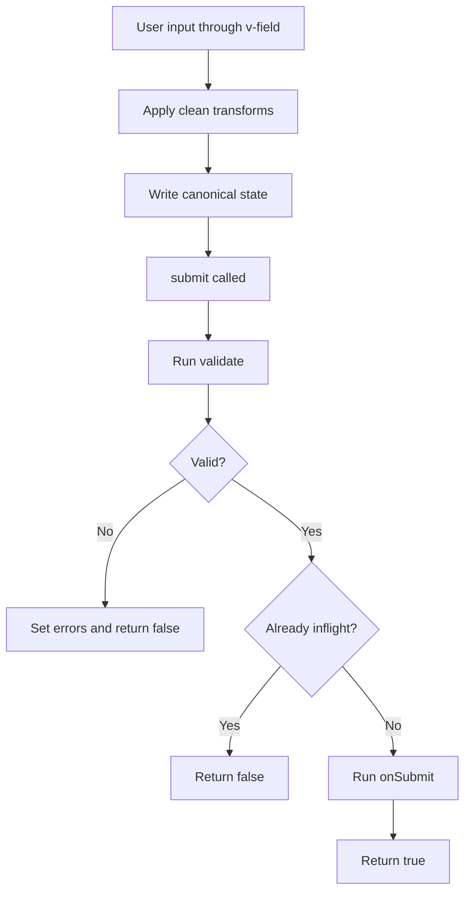

# 4.3. Forms (`valyrian.js/forms`)

Use `FormStore` when you need schema validation, canonical transforms, and consistent submit behavior.

Keep simple forms simple. Move to `FormStore` when form logic starts repeating across screens.

## Quick Start Recipe

1. Create a `FormStore` with `state` + `schema`.
2. Bind `<form v-form={form}>`.
3. Bind inputs with `v-field` and `name`.
4. Call `submit()` or let submit event trigger it.
5. Choose `validationMode` when needed (`safe` default, `fast` opt-in).

## 4.3.1. Basic FormStore

```tsx
import { FormStore } from "valyrian.js/forms";

const loginForm = new FormStore({
  state: { email: "", password: "" },
  validationMode: "safe", // default
  schema: {
    type: "object",
    properties: {
      email: { type: "string", format: "email" },
      password: { type: "string", minLength: 8 }
    },
    required: ["email", "password"]
  },
  clean: {
    email: (value) => String(value).trim().toLowerCase()
  },
  onSubmit: async (values) => {
    await authApi.login(values as { email: string; password: string });
  }
});
```

Common runtime properties:

* `form.state`
* `form.errors`
* `form.isInflight`
* `form.isDirty`

## 4.3.2. `v-form` and `v-field`

```tsx
const Login = () => (
  <form v-form={loginForm}>
    <input name="email" v-field={loginForm} />
    <input name="password" type="password" v-field={loginForm} />

    <p v-if={loginForm.errors.email}>{loginForm.errors.email}</p>
    <p v-if={loginForm.errors.password}>{loginForm.errors.password}</p>

    <button type="submit">Sign in</button>
  </form>
);
```

`v-form` wires submit handling and inflight submit button states.

`v-field` wires value/checked/input behavior by `name`.

`v-field` preserves existing handlers and binds nested controls under the form subtree.

Reader note: in `FormStore` field binding, checkboxes map to boolean state (`checked`), and radio controls map to the selected `value`.

## Form Submit Flow



## 4.3.3. Validation and Submit Contract

* `validate()` updates `errors` and returns `true`/`false`.
* `submit()` returns:
  * `false` if validation fails
  * `false` if already inflight
  * `true` after successful submit
* Common schema formats used in form validation include `email` and `url`.

Validation mode:

* `safe` (default): validates a cloned snapshot of form values.
* `fast`: validates live form values (faster, but schema defaults/custom keywords may mutate state during validation).

`v-form` submit handling always prevents native browser submit navigation and runs the `FormStore` flow first.

```ts
const ok = await loginForm.submit();
if (!ok) {
  console.log(loginForm.errors);
}
```

## 4.3.4. Clean and Format Transforms

* `clean`: `input -> state`
* `format`: `state -> input`

This helps keep state canonical while preserving user-friendly display values.

```tsx
import { Money, formatMoney, parseMoneyInput } from "valyrian.js/money";

const form = new FormStore({
  state: { amountInCents: 0 },
  schema: {
    type: "object",
    properties: {
      amountInCents: { type: "number", minimum: 0 }
    },
    required: ["amountInCents"]
  },
  clean: {
    amountInCents: (value) => parseMoneyInput(String(value), { decimalPlaces: 2 }).toCents()
  },
  format: {
    amountInCents: (value) =>
      formatMoney(Money.fromCents(Number(value) || 0), { currency: "USD", locale: "en-US", digits: 2 })
  }
});
```

## 4.3.5. Additional FormStore APIs

* `validate()` -> updates `errors` and returns boolean.
* `submit(event?)` -> returns success boolean.
* `setField(name, value, control?)` -> writes canonical state for one field.
* `formatValue(name, value, control?)` -> maps canonical value to display value.
* `reset()` -> resets state, errors, and inflight status.

Global schema engine access:

* `formSchemaShield` export from `valyrian.js/forms`.
* `FormStore.schemaShield` static getter.

```ts
import { formSchemaShield } from "valyrian.js/forms";

formSchemaShield.addFormat("starts-with-a", (value) => typeof value === "string" && value.startsWith("A"));
```

Formats/keywords/types added there are shared by all `FormStore` instances.

## Common Beginner Mistakes

1. Forgetting `name` on inputs (required for field mapping).
2. Treating `submit()` as always successful without checking its boolean result.
3. Mixing raw input values and canonical state values without `clean`/`format`.
