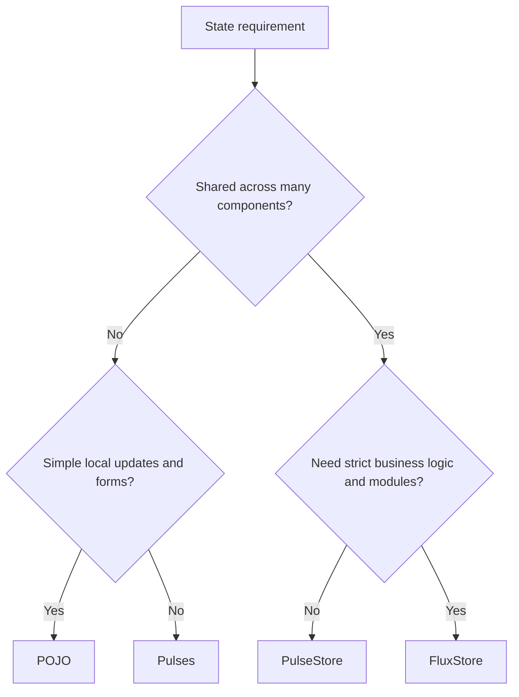

# 5. Advanced State Management (Hub)

Valyrian provides multiple state models so you can match complexity to the real problem.

This chapter is a hub. Use it to choose the smallest state model that solves your current problem.

Rule of thumb: choose the smallest abstraction that keeps behavior clear.

## State Strategy Flow

## 5.1. Choosing a Strategy

| Strategy | Scope | Strength | Tradeoff |
| --- | --- | --- | --- |
| POJO state + events | Local or simple global | Lowest overhead | Less formal structure |
| `createPulse` | Atomic values | Fine-grained updates | You compose manually |
| `createPulseStore` | Shared state + actions | Ergonomic with immutable writes | More structure than POJO |
| `FluxStore` | Large modular apps | Strong architecture + events/plugins | More ceremony |

## 5.2. Pulses

* File: [./5-pulses.md](./5-pulses.md)
* Covers `createPulse`, `createEffect`, `createPulseStore`, `createMutableStore`, and store pulse events.

## 5.3. FluxStore

* File: [./5-flux-store.md](./5-flux-store.md)
* Covers commit/dispatch/getters, namespaced modules, event hooks, and plugin behavior.

## 5.4. Redux DevTools Bridge

* File: [./5-redux-devtools.md](./5-redux-devtools.md)
* Covers `connectFluxStore`, `connectPulseStore`, `connectPulse`, and safe no-op behavior when extension is missing.

## Suggested Reading Order

1. [./5-pulses.md](./5-pulses.md)
2. [./5-flux-store.md](./5-flux-store.md)
3. [./5-redux-devtools.md](./5-redux-devtools.md)
