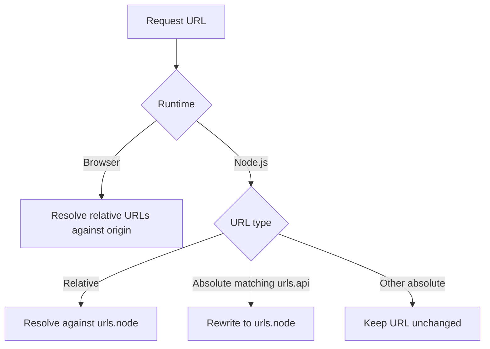

# 7.2. Isomorphic Networking and Storage

Start with one endpoint first. Confirm URL rewriting works in Node.js, then expand to the rest of your API surface.

## Request URL Rewriting (`valyrian.js/request`)

Server runtime often needs different API hosts than browser runtime. Configure `request` with `urls`.

```ts
import { request } from "valyrian.js/request";

request.setOption("urls", {
  base: "",
  node: "http://localhost:3000",
  api: "https://api.example.com"
});
```

Behavior summary:



* In browser: relative URLs are resolved against `window.location.origin`.
* In Node.js:
  * relative URLs are resolved against `urls.node`
  * absolute URLs matching `urls.api` are rewritten to `urls.node`

## Scoped Request Instances per Incoming Request

`request` is a singleton. For SSR, create scoped instances to avoid cross-request header leakage.

```ts
import { request } from "valyrian.js/request";
import { render } from "valyrian.js/node";

app.get("*", (req, res) => {
  const api = request.new("", {
    headers: {
      Cookie: req.headers.cookie || "",
      Authorization: req.headers.authorization || ""
    }
  });

  const html = render(<App api={api} />);
  res.send(html);
});
```

## Request-Scoped Storage (`ServerStorage`)

`valyrian.js/node` provides `ServerStorage` to isolate `sessionStorage`/`localStorage` per async request context.

```ts
import { ServerStorage, render } from "valyrian.js/node";

app.use((req, _res, next) => {
  ServerStorage.run(() => {
    if (req.headers.cookie) {
      sessionStorage.setItem("cookie", req.headers.cookie);
    }
    next();
  });
});
```

Inside this context, code can read/write storage with the same APIs used in browser code.

Reader tip: wrap the full request lifecycle in `ServerStorage.run(...)` so async work in that request keeps the same isolated storage context.

## Native Store in Isomorphic Code

```ts
import { createNativeStore, StorageType } from "valyrian.js/native-store";

const session = createNativeStore("user-session", { user: null }, StorageType.Session);
```

In Node.js, import `valyrian.js/node` before creating native stores.
