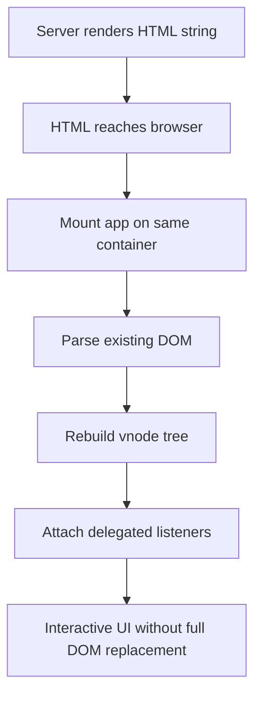

# 7.1. Server-Side Rendering

Server rendering in Valyrian is built around `render` from `valyrian.js/node`.

For full node runtime exports (`render`, DOM helpers, `ServerStorage`, build helpers), see [./7-node-runtime-apis.md](./7-node-runtime-apis.md).

## Quick Start Checklist

1. Import `render` from `valyrian.js/node`.
2. Render one component to string.
3. Return that HTML from your HTTP handler.
4. Mount the same app on the same browser container.

## Render to HTML String

```tsx
import { render } from "valyrian.js/node";

const App = () => <div>Hello SSR</div>;
const html = render(<App />);
```

`render()` returns markup as string.

## Automatic DOM Rehydration

When SSR HTML reaches the browser, mount your app on the same container used for the server markup.

During mount, Valyrian parses existing DOM, rebuilds the vnode tree, then continues normal patching and delegated event wiring.

This makes server-rendered markup interactive without replacing the full DOM tree.



## Guard Browser-Only Code

Use `isNodeJs` from `valyrian.js` when components need browser APIs.

```tsx
import { isNodeJs } from "valyrian.js";

const Component = () => {
  if (!isNodeJs) {
    console.log(window.innerWidth);
  }
  return <div>Safe in both runtimes</div>;
};
```
