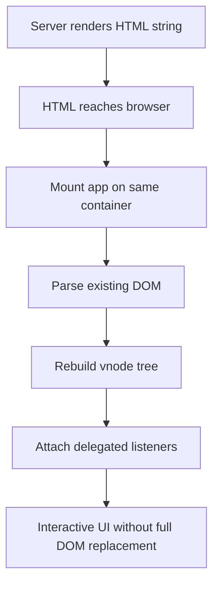

# 7.1. Server-Side Rendering

Server rendering in Valyrian is built around `render` from `valyrian.js/node`.

For full node runtime exports (`render`, DOM helpers, `ServerStorage`, build helpers), see [./7.1.1-node-runtime-apis.md](./7.1.1-node-runtime-apis.md).

## Quick Start Checklist

1. Import `render` and `ServerStorage` from `valyrian.js/node`.
2. Render one component tree to HTML per request.
3. Send a full HTML document where the app owns the `<body>`.
4. Mount the same app on `body` in the browser with the same initial state shape.

## Main App Component

```tsx
export const App = ({ initialState }) => <div>Hello SSR at {initialState.path}</div>;
```

## Render to HTML String

```tsx
import { render } from "valyrian.js/node";
import { App } from "./app";

const html = render(<App initialState={{ path: "/" }} />);
```

`render()` returns markup as a string.

## End-to-End HTTP + Hydration Recipe

Use this pattern to ship one full SSR request cycle (server render + browser hydration).

```tsx
import { v } from "valyrian.js";
import { render, ServerStorage } from "valyrian.js/node";
import { App } from "./app";

export function AppShell({ initialState }, children) {
  const serializedState = JSON.stringify(initialState).replace(/</g, "\\u003c");

  return (
    <>
      {"<!doctype html>"}
      <html lang="en">
        <head>
          <meta charset="utf-8" />
          <meta name="viewport" content="width=device-width,initial-scale=1" />
          <title>Valyrian SSR</title>
        </head>
        <body>
          {children}
          <script>{`window.__INITIAL_STATE__=${serializedState};`}</script>
          <script type="module" src="/client-entry.js"></script>
        </body>
      </html>
    </>
  );
}

app.get("*", (req, res) => {
  ServerStorage.run(() => {
    const initialState = { path: req.url };
    const html = render(
      <AppShell initialState={initialState}>
        <App initialState={initialState} />
      </AppShell>
    );

    res.type("html").send(html);
  });
});
```

Browser entry:

```tsx
import { mount } from "valyrian.js";
import { App } from "./app";

declare global {
  interface Window {
    __INITIAL_STATE__?: Record<string, unknown>;
  }
}

mount("body", <App initialState={window.__INITIAL_STATE__ || { path: "/" }} />);
```

Hydration safety checklist:

1. Render and mount on the same container (`body` in this example).
2. Reuse the same initial state shape on server and browser.
3. Keep first-render markup deterministic for the same props/state.

## Router-Driven SSR (Optional)

For route-first rendering, keep route definitions in the app, export the router, and reuse it in Node.

```tsx
import "valyrian.js/node";
import { router } from "./app";

const routeHtml = await router.go("/users/123");
```

Use `routeHtml` as the routed fragment inside your shell response.

## SSR + Router Prefetch + Client Refetch

This pattern keeps data-fetching in router middlewares/routes and uses the same app router in backend and browser.

App module (router source of truth):

```tsx
import { Router, mountRouter } from "valyrian.js/router";
import { request } from "valyrian.js/request";
import { UserPage } from "./user-page";

const api = request.new("", {
  urls: {
    base: "",
    api: "https://api.example.com",
    node: "http://localhost:3000"
  }
});

export const router = new Router();

router.add("/users/:id", async (req) => {
  const user = await api.get(`/api/users/${req.params.id}`);
  return () => <UserPage user={user} />;
});

mountRouter("body", router);
```

Backend handler:

```tsx
import "valyrian.js/node";
import { render, ServerStorage } from "valyrian.js/node";
import { router } from "./app";
import { AppShell } from "./app-shell";

app.get("*", (req, res, next) => {
  ServerStorage.run(() => {
    void (async () => {
      const routeHtml = (await router.go(req.url)) || "";
      const html = render(
        <AppShell html={`${routeHtml}<script type="module" src="/client-entry.js"></script>`} />
      );
      res.type("html").send(html);
    })().catch(next);
  });
});
```

Client entry:

```tsx
import "./app";
```

Flow result:

1. Server `await router.go(req.url)` prefetches route data and returns SSR HTML.
2. Browser loads rendered HTML first.
3. Browser import runs `mountRouter("body", router)` again and the route prefetch runs again for fresh data.

This gives fast first paint with SSR data and an immediate freshness pass on client mount.

## Automatic Route Registration for Express/Fastify

If your Valyrian app router is the source of truth, the backend can register server routes directly from `router.routes()`.

The backend does not call `router.add(...)` in this pattern. It imports the router from the app and resolves each request with `router.go(req.url)`.

`router.routes()` returns paths like `/users/:id` and wildcard patterns ending in `/.*` (for example `/files/.*` and `/.*`). Keep iteration as returned by `router.routes()` and avoid backend reordering.

`AppShell` for route-fragment rendering:

```tsx
export function AppShell({ html }) {
  return (
    <>
      {"<!doctype html>"}
      <html lang="en">
        <head>
          <meta charset="utf-8" />
          <meta name="viewport" content="width=device-width,initial-scale=1" />
          <title>Valyrian SSR</title>
        </head>
        <body v-html={html} />
      </html>
    </>
  );
}
```

Express example:

```tsx
import "valyrian.js/node";
import { render, ServerStorage } from "valyrian.js/node";
import { router } from "./app";
import { AppShell } from "./app-shell";

const allRoutes = router.routes();

const toExpressPath = (routePath: string) => (routePath === "/.*" ? "*" : routePath.replace(/\/\.\*$/, "/*"));

for (const routePath of allRoutes) {
  app.get(toExpressPath(routePath), (req, res, next) => {
    ServerStorage.run(() => {
      void (async () => {
        const initialState = { path: req.url };
        const routeHtml = (await router.go(req.url)) || "";
        const serializedState = JSON.stringify(initialState).replace(/</g, "\\u003c");
        const htmlString = `${routeHtml}<script>window.__INITIAL_STATE__=${serializedState};</script><script type="module" src="/client-entry.js"></script>`;
        const html = render(<AppShell html={htmlString} />);
        res.type("html").send(html);
      })().catch(next);
    });
  });
}
```

Fastify example:

```tsx
const toFastifyPath = (routePath: string) => (routePath === "/.*" ? "/*" : routePath.replace(/\/\.\*$/, "/*"));

for (const routePath of allRoutes) {
  fastify.get(toFastifyPath(routePath), async (request, reply) => {
    return ServerStorage.run(async () => {
      const initialState = { path: request.url };
      const routeHtml = (await router.go(request.url)) || "";
      const serializedState = JSON.stringify(initialState).replace(/</g, "\\u003c");
      const htmlString = `${routeHtml}<script>window.__INITIAL_STATE__=${serializedState};</script><script type="module" src="/client-entry.js"></script>`;
      const html = render(<AppShell html={htmlString} />);
      return reply.type("text/html").send(html);
    });
  });
}
```

## Automatic DOM Rehydration

When SSR HTML reaches the browser, mount your app on the same container used for the server markup.

During mount, Valyrian parses existing DOM, rebuilds the vnode tree, then continues normal patching and delegated event wiring.

This makes server-rendered markup interactive without replacing the full DOM tree.



## Guard Browser-Only Code

Use `isNodeJs` from `valyrian.js` when components need browser APIs.

```tsx
import { isNodeJs } from "valyrian.js";

const Component = () => {
  if (!isNodeJs) {
    console.log(window.innerWidth);
  }
  return <div>Safe in both runtimes</div>;
};
```
