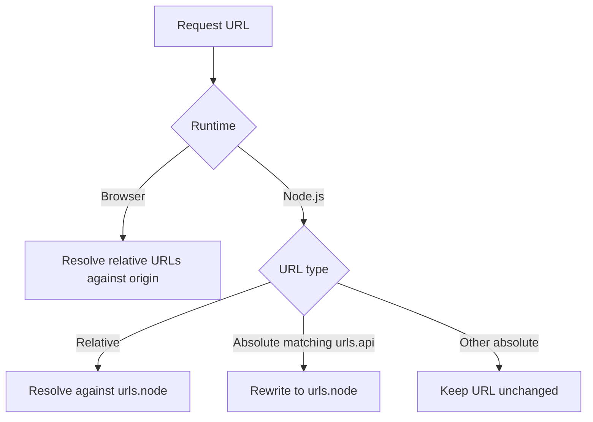

# 7.2. Isomorphic Networking and Storage

Start with one endpoint first. Confirm URL rewriting works in Node.js, then expand to the rest of your API surface.

## Request URL Rewriting (`valyrian.js/request`)

Server runtime often needs different API hosts than browser runtime. Configure `request` with `urls`.

```ts
import { request } from "valyrian.js/request";

request.setOption("urls", {
  base: "",
  node: "http://localhost:3000",
  api: "https://api.example.com"
});
```

Behavior summary:



- In browser: relative URLs are resolved against `window.location.origin`.
- In Node.js:
  - relative URLs are resolved against `urls.node`.
  - absolute URLs matching `urls.api` are rewritten to `urls.node`.

## Scoped Request Instances per Incoming Request

`request` is a singleton. For SSR, create scoped instances to avoid cross-request header leakage.

```ts
import { request } from "valyrian.js/request";
import { render } from "valyrian.js/node";

app.get("*", (req, res) => {
  const api = request.new("", {
    headers: {
      Cookie: req.headers.cookie || "",
      Authorization: req.headers.authorization || ""
    }
  });

  const html = render(<App api={api} />);
  res.send(html);
});
```

Context note:

- In Node.js request context (`ServerStorage.run(...)`), calling `request.new(...)` sets that scoped client as the active request context for the current async request.
- Calls through the exported singleton `request` inside that same request context resolve to the contextual scoped client.

## End-to-End Isomorphic Prefetch Flow

Use this recipe when the server should prefetch data and the browser should continue from that same state.

This version skips duplicate first-load fetches when SSR already provided data.

If you want route middleware to prefetch on SSR and fetch again on client mount for freshness, see [./7.1-ssr.md](./7.1-ssr.md) (SSR + Router Prefetch + Client Refetch).

Shared app component:

```tsx
import { onCreate, update } from "valyrian.js";

export const App = ({ api, initialState }) => {
  const state = {
    user: initialState.user || null,
    loading: false
  };

  onCreate(async () => {
    if (state.user) {
      return;
    }

    state.loading = true;
    update();

    state.user = await api.get(`/api/users/${initialState.userId}`);
    state.loading = false;
    update();
  });

  if (state.loading) return <p>Loading...</p>;
  if (!state.user) return <p>No data</p>;
  return <h1>{state.user.name}</h1>;
};
```

Server request handler:

```tsx
import { request } from "valyrian.js/request";
import { render, ServerStorage } from "valyrian.js/node";
import { App } from "./app";
import { AppShell } from "./app-shell";

app.get("/users/:id", (req, res, next) => {
  ServerStorage.run(() => {
    void (async () => {
      const api = request.new("", {
        headers: {
          Cookie: req.headers.cookie || "",
          Authorization: req.headers.authorization || ""
        }
      });

      const user = await api.get(`/api/users/${req.params.id}`);
      const initialState = { userId: req.params.id, user };

      const html = render(
        <AppShell initialState={initialState}>
          <App api={api} initialState={initialState} />
        </AppShell>
      );

      res.type("html").send(html);
    })().catch(next);
  });
});
```

Browser entry:

```tsx
import { mount } from "valyrian.js";
import { request } from "valyrian.js/request";
import { App } from "./app";

declare global {
  interface Window {
    __INITIAL_STATE__?: { user?: any; userId?: string };
  }
}

const api = request.new("", {
  urls: {
    base: "",
    api: "https://api.example.com",
    node: "http://localhost:3000"
  }
});

mount("body", <App api={api} initialState={window.__INITIAL_STATE__ || {}} />);
```

This keeps one fetch path while avoiding duplicate first-load requests when SSR already provided the data.

## Request-Scoped Storage (`ServerStorage`)

`valyrian.js/node` provides `ServerStorage` to isolate `sessionStorage`/`localStorage` per async request context.

```ts
import { ServerStorage } from "valyrian.js/node";

app.use((req, _res, next) => {
  ServerStorage.run(() => {
    if (req.headers.cookie) {
      sessionStorage.setItem("cookie", req.headers.cookie);
    }
    next();
  });
});
```

Inside this context, code can read/write storage with the same APIs used in browser code.

Reader tip: wrap the full request lifecycle in `ServerStorage.run(...)` so async work in that request keeps the same isolated storage context.

## Native Store in Isomorphic Code

```ts
import { createNativeStore, StorageType } from "valyrian.js/native-store";

const session = createNativeStore("user-session", { user: null }, StorageType.Session);
```

In Node.js, import `valyrian.js/node` before creating native stores.
